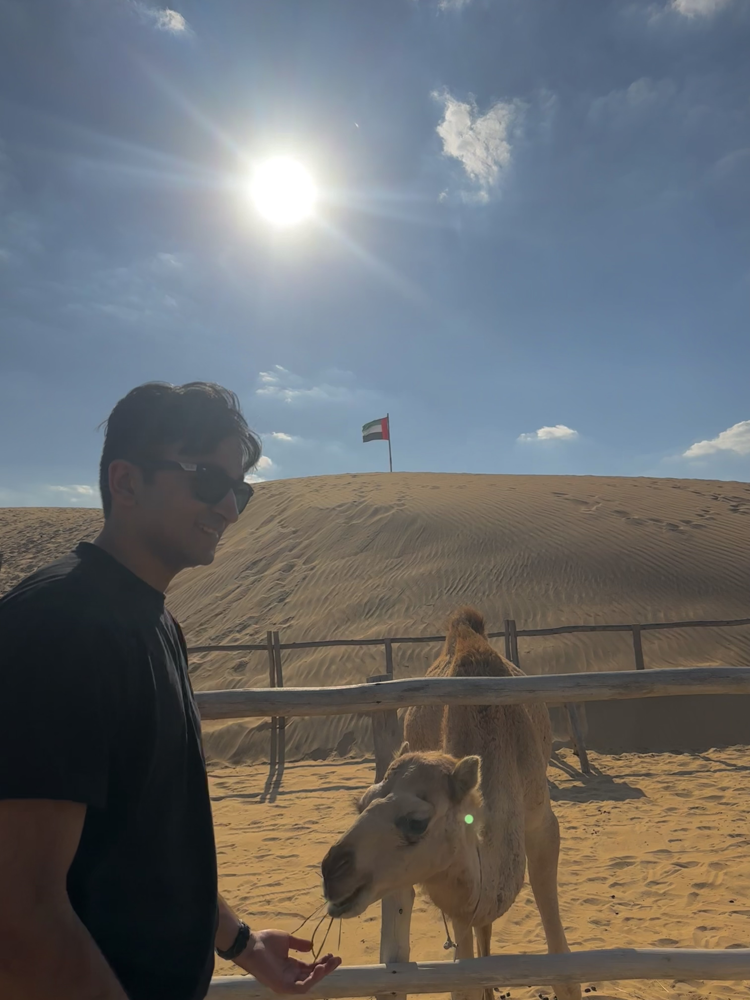
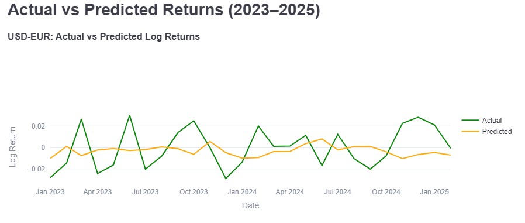
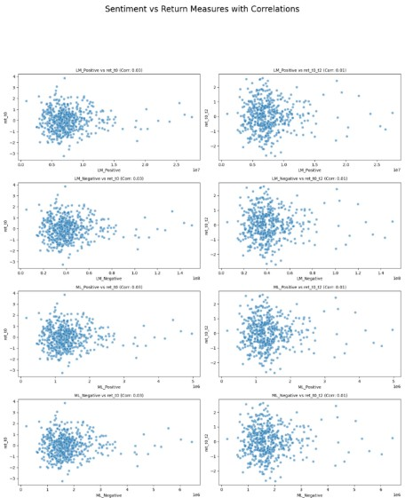

## About Me

HiI am a senior at lehigh graduating in May 2025. I'm studying Statistics and Finance. After graduation, I will be working at Deuthsche Bank in the Industrials group in NYC. I'm very interested in commodities, energy transition, and the emergence of new technologies (AI).
I grew up moving across East Africa and South Asia and am also very interested in emerging markets economic development and international relations!

## Project Portfolio

<!-- You can link to other websites, PDFs in this repo, and other pages in this repo -->

_**[Macro Drivers of Dollar Strength - A Cross-Currency Analysis](https://thereddestbulls.streamlit.app/)**_

We analyzed how U.S. macroeconomic factors (like interest rates, inflation, and trade balance) impact the strength of the U.S. dollar against the world’s top currencies.

Below is the 5 year forecast from the dashboard for USD-EUR, Macroeconomic Variables (2.7% Interest Rate & 2.3% Inflation), XGBoost model

---

_**[Natural language processing 10-Ks to identify risks](midtermreport.md)**_

Using data dictionaries, sentiment ratings, and financial topic word lists, 10-K filings from S&P 500 firms were analyzed and compared with stock returns around their filing dates to identify correlations between document sentiment and market performance.

---

## Career Objectives

I want to get exposure to different deal processes through my investment banking role at Deutsche Bank. Afterwards, I aim to pivot to an investing role where I can leverage my knowledge in company analysis to identify undervalued opportunities in the Industrials and Commodities spaces. Investing required discipline in terms of understanding what a business is truly worth and not what it's being marketed as. I'm excited to build this investor lens!

---

## Hobbies

I'm a supporter of Arsenal Football Club and the Pakistani national cricket team. I enjoy going on safari trips in Kenya and have a strong appreciation for house and Afrohouse music.

---
---

## Contact Information

Personal email: muzammiljawed2002@gmail.com     
School email: muj225@lehigh.edu    

---

---
