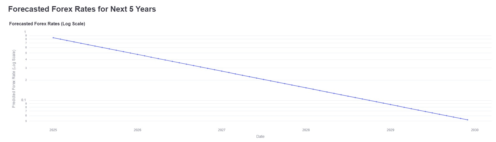

## About Me

Hi! I’m a senior at Lehigh University, graduating in May 2025 with a dual major in Statistics and Finance. Upon graduation, I’ll be joining Deutsche Bank in New York City as part of the Industrials Investment Banking group.

I have a strong interest in commodities, the energy transition, and emerging technologies such as artificial intelligence. Having grown up across East Africa and South Asia, I’m also deeply engaged with topics related to emerging markets, economic development, and international relations.

## Project Portfolio

<!-- You can link to other websites, PDFs in this repo, and other pages in this repo -->

_**[Macro Drivers of Dollar Strength - A Cross-Currency Analysis](https://thereddestbulls.streamlit.app/)**_

I analyzed how U.S. macroeconomic factors (like interest rates, inflation, and trade balance) impact the strength of the U.S. dollar against the world’s top currencies.

Below is the 5 year forecast from the dashboard for USD-EUR, Macroeconomic Variables (2.7% Interest Rate & 2.3% Inflation), XGBoost model

---

_**[Natural language processing 10-Ks to identify risks](midtermreport.md)**_

Using data dictionaries, sentiment ratings, and financial topic word lists, 10-K filings from S&P 500 firms were analyzed and compared with stock returns around their filing dates to identify correlations between document sentiment and market performance.

---

## Career Objectives

Through my investment banking role at Deutsche Bank, I’m eager to gain exposure to a variety of deal processes and deepen my understanding of corporate finance. Longer term, I aim to transition into an investing role where I can apply my skills in company analysis to identify undervalued opportunities, particularly in the Industrials and Commodities sectors. I believe successful investing requires the discipline to assess a company’s intrinsic value - beyond how it's marketed - and I’m excited to continue developing that investor mindset.

---

## Hobbies

I'm a supporter of Arsenal Football Club and the Pakistani national cricket team. I enjoy going on safari trips in Kenya and have a strong appreciation for house and Afrohouse music.

---
---

## Contact Information

Personal email: muzammiljawed2002@gmail.com     
School email: muj225@lehigh.edu    

---

---
