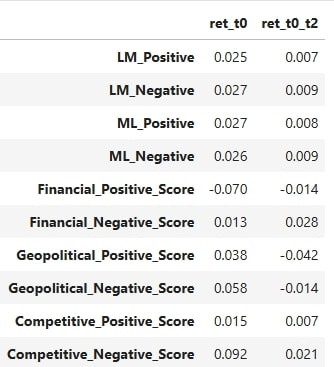
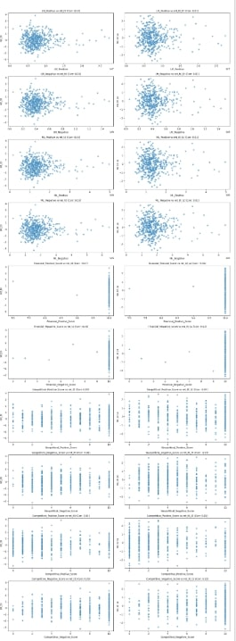

# 1. Summary 

Context: For this project, I explored the relationship between different
sentiment measures that were calculated through analyzing 10-K filings
and stock returns for the companies in the S&P 500 index. In total,
there are 10 sentiment variables, 5 total sentiment methods each having
it\'s positive and negative sentiment variable. The main two sentiment
methods (4 variables) were derived using two different sentiment
dictionaries provided to me (LM and ML), which had classifications of
\"positive\" and \"negative\" words. The other 3 methods (6 variables)
were contextual sentiment methods that were allocating a sentiment score
(for both the positive and negative variables) based on each company\'s
financial performance wordings, geopolitical conditions/risk wordings,
and business competition landscape wordings. I then compared each
firm\'s sentiment score with stock price performance around the filing
date.

Findings: My results generally showed a weak correlation between the
sentiment variables and stock price returns around the filing date. The
LM and ML positive and negative sentiment measures showed a very minimal
association with the returns, especially during the filing date or just
a few days after the filing date. On the other hand, the contextual
sentiment measures focusing on financial, geopolitical and competitive
aspects showed some variation but still lacked strong predictive power.
Some contextual sentiment measures such as competitive positive
sentiment had a very small positive correlation with returns, but the
overall relationships were very weak and didn\'t make any storng claims.
The overall project findings showed me that while sentiment may play a
role in stock price movement, there are other factors that have much
weightier controbutions to the price returns.

# 2. DATA Section {#2-data-section}

Sample 
The sample data is for all S&P 500 firms that submitted a 10-K
filing between January 1st and December 31st, 2022. A total of 498 10-K
files were then analyzed. In the get_text_files_zipAFTER.pyn file, I
started by importing all the relevant libraries such as glob for data
management and sec_edgar_downloader to access the various 10-K filings
on the SEC\'s website. I checked whether the file existed, and if not
then scraped and saved the data from a revision of Wikipedia\'s S&P 500
list using the December 2022 version of the page. My script iterated
over each company\'s CIK using the tqdm function, and then constructed a
folder in line with the proper SEC formatting. I also checked for if any
HTML 10-K files existed and if not then fetched it using dl.get(\...)
with after=\"2022-01-01\" and before=\"2022-12-31\". After downloading
the 10-Ks, I deleted all .txt files in order to save space. I also
further compressed the files to a 10k_files.zip folder, and then moved
it into the 10k_files directory.

Return variables Because I had trouble with my 10-K identifier code, I
decided to go with the random generation for returns variables. The code
for simulating \"fake\" returns was referenced from the professor, who
had provided it on the midterm discussion board. Random returns were
geneated for three types: return on the day of 10-k filing, return from
day t to day t+2, and return from day t +3 to day t + 10.

Sentiment variables The two main sentiments were the LM
(Loughran-McDonald) and ML (Machine Learning-based) sentiment variables
that had both positive and negative sentiment values. For both the LM
and ML methods, I referenced the class code on the
Build_Sample_Exercises file initially, and then made several
modifications. The key modifications I made and their explanations are
below: When I run the following code:

When I ran the following code:

#print(\"LM Positive:\", len(sentiment_words\[\'LM_positive\'\]))

#print(\"LM Negative:\", len(sentiment_words\[\'LM_negative\'\]))

#print(\"ML Positive:\", len(sentiment_words\[\'ML_positive\'\]))

#print(\"ML Negative:\", len(sentiment_words\[\'ML_negative\'\]))

I got the following word counts:

-   LM Positive: 345
-   LM Negative: 2305
-   ML Positive: 75
-   ML Negative: 94

# Modification 1: Created a load_sentiment_words() function
I created a reusable load_sentiment_words() function to load sentiment words from
the ML and LM sentiment dictionaries. The LM dictionary was filtered to
only include words that were tagged as relevant for the year 2009, which
aligns with academic convention for sentiment analysis. I specifically
excluded words that had \"0\" in both the positive and negative columns
of the LM CSV file, as those were neutral and not useful for sentiment
analysis. This approach ensures the code is clean, self-contained, and
testable, in line with the best practices mentioned in the textbook.

# Modification 2: Calculating Positive Sentiment Ratios

I did this because the raw sentiment scores themselves are sensitive to
document length. naturally, longer 10-ks will have more of all words and
hence a great score allocated to them. Calculating a ratio standardises
the results and normalizes for document size, painting a clearer
picture. In the code, I made sure to avoide dividing by zero using
conditional logic code. Although i\'d expected varying results, I was
quite shocked by how the firms had a very smilar positive sentiment
ratio across the board

# Modification 3: Clearning HTML using BeautifulSoup and Regex

Before any data cleaning, I sampled a few 10-k files to identify parts
of the text that I can filter out to make the raw text less polluted.
There were HTML tags, special characters, numbers, unwanted formatting,
links, symbols, excessive commas and other \"noise\" items. After
cleaning, I found the precision of word matching to improve greatly for
sentiment scoring. For this, I used regex and string operations to clean
the data withough over-cleaning / removing valuable content in the text.

# Contextual Sentiment Analysis

I decided to go with the following contextual sentiment approaches:

1.  Financial Performance: A company\'s financial performance is a key
    driver of it's stock price. After all, no one wants to take an
    equity investment in a firm that is losing money or is in a downard
    trajectory. Given how ig the S&P 500 list is, I assumed that there
    will be companies that might have significantly positive or negative
    wordings when it comes to their financials. The words I chose for
    this from the ML list are:

good_financial_positive = 'growth', 'outperformance','exceeded', 'record'
good_financial_negative = 'underperformance', 'declined', 'weakness', 'loss'

1.  Geopolitical Impact: It is o surprise that 2022 was a historical
    year when it came to geopolitical conditions. The Russia/Ukraine
    war, lingering effects of Covid, rising inflation and interest rates
    across the world and more certainly created a frothy geopolitical
    environment for many of the S&P 500 companies. Hence, I screened for
    words that could be related to "geopolitics" such as unexpected.
    The words chosen were:

ideal_geopolitical_positive = 'favorable', 'momentum'
ideal_geopolitical_negative = 'unexpected', 'challenging'

1.  Business Competition: A business with a solid moat around its castle
    will be an attractive company and it\'s share price movements will
    reflect that strength. During 2021, a lot of big companies underwent
    financial distress. This led to financial bankruptcy for many, but
    also the emergence of "stronger" firms that doubled down on their
    competitive advantages and weeded out the competition. The words I
    chose for this were:

strong_competitive_positive = 'strength', 'solid'
strong_competitive_negative = 'pressures', 'challenges'

After this was set up, I proceeded to Measure the contextual sentiment.
I implemented a regex approach using the re module to scan the cleanred
10-k text for the exact matches of the sentiment specific words listed
above. I applied word boundary patterns so that the matches only
targetted complete words and not making critical errors (for example
matching growth but not regrowth). Lastly, I capped each score at 10 in
order to keep the scores intepratable by anyone looking at the data/
code. Based on the textbook guidance, this approach is dynamic and can
be extended by easily updating the world lists or even changing the
regex for a more advanced analysis.

# Intepretation of summary statistics

There are several interesting insights about the dataset from the summary statistics table
in the code Firstly, the LM sentiment scores are significantly greater than 
the ML scores. I think this discrepency is because the LM dictionary is simply
larger and tracks more words as positive and negative. The positive and
negative sentiment ratios also tell me that while firms in general
report more neautral or negative wording, the ML picks up more positive
text in general.

For the xontextual sentiment scores (o to 10), I found some interesting
results:

1.  The Financial_Positive_Score had a mean of 9.99 with a very low
    standard deviation. This tells me that all firms use highly positive
    language when it comes to their financials, even if the company is
    actually not doing that well. This seems a bit fishy to me, but I
    also understand that a negative tone on the financial could cause an
    investor exodus. Hence, the question is more about ethics and
    whether it\'s right to make a situation seem better than it is,
    especially since financial metrics such a s\"Adjusted EBITDA\" can
    easily be tailored to support a specific story.

2.  Interestingly, the negative scores for Geopolitics and Business
    Competition showed more variability (standard deviation of around
    3.3 and 3.1) which signals that company tone can vary substantially
    depending on the topic being discussed.

The Geopolitical_Negative_Score has a mean of 4.58 and a max of 10,
which reflects 2022\'s volatile macroneconomic environment, including
war and inflation. Although it doesn\'t look like the returns are
significantly correlated with the sentiments / sentiment scores.

1.  Looking at the returns, the mean is close to zero, which makes sense
    since I had randomly generated variables (which are typically
    centered around mean 0). However, both ret_t0_t2 and ret_t2_t10 show
    higher means and standard deviations above 1, which I find a bit
    funny as they replicate wider price movements post 10-k release as
    investors digest firm disclosures. ALthough in this case, it was a
    oure conincidence since the returns were randomly generated.

Overall, I think the contextual sentiment variables do pass basic smell
tests. There is clear variation in the scores, which range from 0 to 10,
indicating that the sentiment measures are not constant. They also tell
a story, for example the high mean score of Financial_Positive_Score
(9.99) tells me that firms like to highlight strength and growth
consistentyly, making the 10-k reports aimed at reassuring investors.
There is also more spread in Geopolitical and Competitive sentiment,
which suggests that not all firms are equally optimistic in other
topics. This alligns with reality, as firms in supply chain, commodities
and other sensitive sectors might be more exposed to undertainty. No
immediate red flags appear. There is no clustering at a single value.
The potential shortfalls are my own, such as capping the score limit at
10.

Caveats: There are some cavteas to note. Firstly, while the data is very
robust, the LM and ML dictionaries have extremely high counts. There
could be repeated languages that are inflating frequency without actuall
adding any sentiment nuance. Secondly, the sentiment ratio variables,
althoughnormalized due show very little variation (especially
LM_Positive_Ratio). This could be a problem for further analysis, such
as limiting explanatory value in regression analysis. Moreover, because
I capped the contextual sentiment scores at 10, some firms with much
more sentiment-heavy language aren\'t distinguishable from those who
just pass the threshold. This should deinitely be further explored in
future work, either by increasing the cap or using another type of
scoring method such as relative scoring. Lastly, the biggest caveat is
that the returns are all simulated data and reflect \"white noise\"
rather than actual market behaviour. In a more accurate analysis, the
return calculations based on actual price movements might reveal a
completely difference picture.

# 3. Results 

# Discussion

1.  LM vs ML Sentiment and returns Both the LM and ML sentiment measures
    show very small correlations with returns on the day of 10-K filing.
    LM_Positive: 0.025 ML_Positive: 0.027 LM_Negative: 0.027
    ML_Negative: 0.026 This shows that positive or negative tone has
    very little predictive power on the same-day returns in thsi sample.
    If I was to apply this finding to the real world, firms often use
    vague or generic language in filings to downplay risk (maybe these
    words are not being captured by the dictionaries)

2.  In Table 3 of Gracia et al., the ML sentiment were showing stronger
    and more significant relationships with returns. My sample is
    limited to just one year (2022) and is not as large and complicated
    as the authors\'. I don\'t believe my results conflict with the
    Table 3 results, it just shows the difficulty of extracting signal
    from a small sample with simple metrics.

3.  Some contextual measures do show more noticeable correlations:

Geopolitical_Negative_Score: 0.058 with ret_t0 Financial_Positive_Score:
-0.070 with ret_t0 Competitive_Negative_Score: 0.092 with ret_t0

The strongest is Competitive_Negative_Score which has a moderately
positive correlation of 0.092. This tells me that when firms talk about
their competitive pressures negatively, investors might actually think
of the firm as being transparent and honest and might actually reward
them. Again, my returns were simulated but I would intepret it this way
if they were real returns. Surprisingly, Ginancial_Positive_Score is
negatively correlated (-0.070) which reflects the market calling out
over optimistic language as a facade.

1.  ML Sentiment and longer time windows (ret_t0_t2, ret_t2_t10)

ML sentiment variables maintain similarly small correlations with longer
return timeframes:

ML_Positive: 0.008 (t0_t2), 0.008 (t2_t10) ML_Negative: 0.009 (t0_t2),
0.009 (t2_t10)

This tells me that any sentiment effect is quickly priced in and that
there is no delayed reaction to 10-k tone in days after filing. This
supports the efficient market hypothesis. I don\'t think it would be the
case if my returns were real and not simulated.
:::
